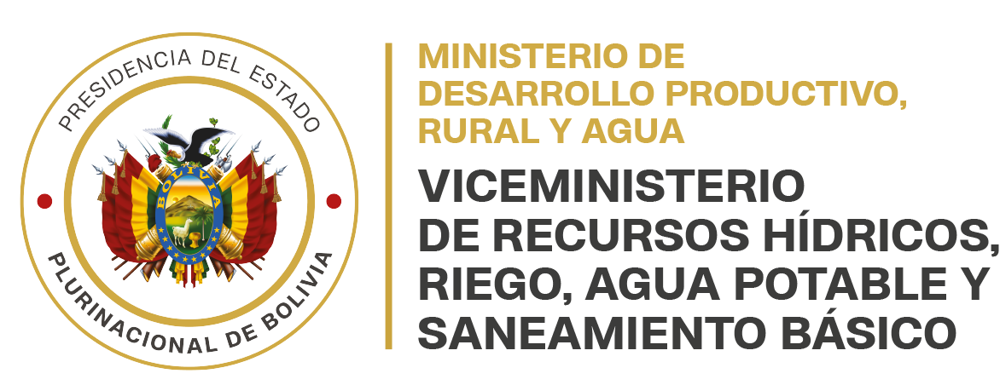
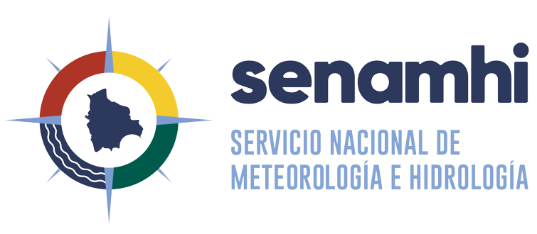
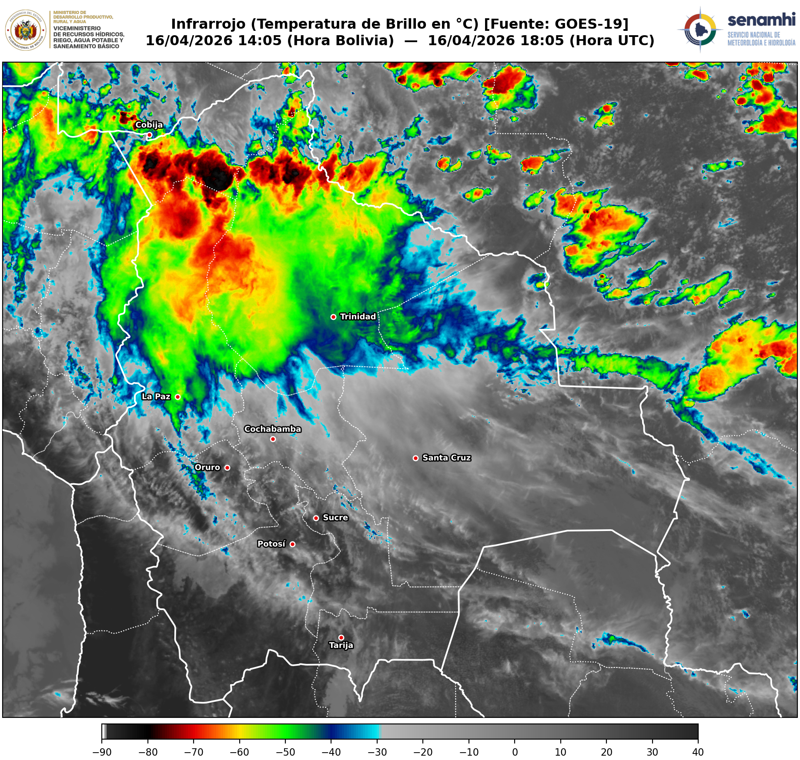
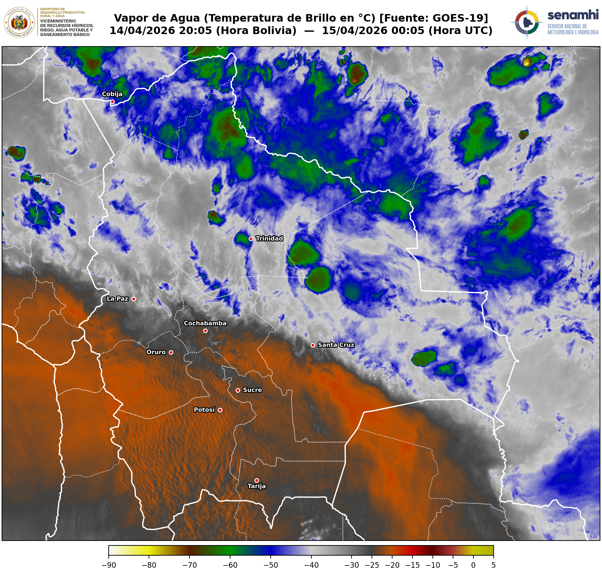
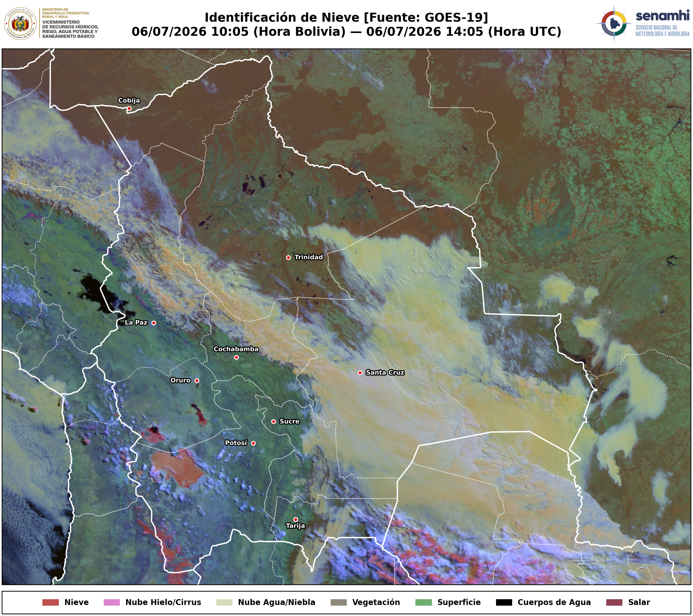
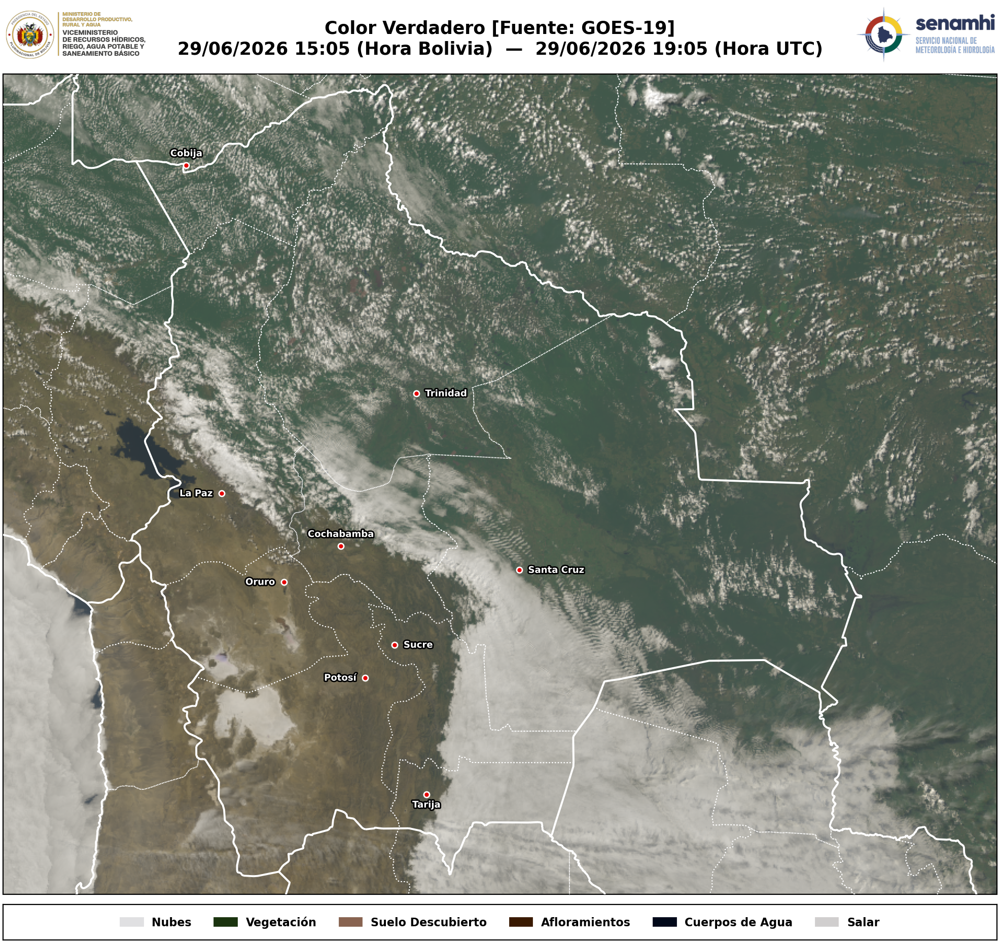

<!-- CABECERA INSTITUCIONAL -->
<table width="100%" border="0" style="border-collapse: collapse; border: none;">
  <tr>
    <!-- Logo Ministerio (Izquierda) -->
    <td align="left" valign="middle" width="40%" style="border: none;">
      
    </td>
    <!-- Espaciador Central -->
    <td align="center" valign="middle" width="20%" style="border: none;">
      <!-- Espacio vacío central para mantener balance -->
    </td>
    <!-- Logo SENAMHI (Derecha) -->
    <td align="right" valign="middle" width="50%" style="border: none;">
      
    </td>
  </tr>
</table>

---
# Sistema de Procesamiento y Estandarización de Imágenes Satelitales GOES-19 para SENAMHI-Bolivia (Versión 1.0)

Este repositorio contiene el **entorno operativo de scripts en Python** desarrollado para la descarga autónoma, calibración física y maquetación automatizada de productos de la nueva generación de satélites **GOES-19 (East)**, optimizados específicamente para el territorio del Estado Plurinacional de Bolivia.

El proyecto nace con el objetivo de dotar a los pronosticadores del **SENAMHI** de productos visuales con un estándar de diseño unificado, colineal y de alta definición, eliminando la dependencia de servidores externos y procesando los datos directamente de la fuente cruda (*NetCDF L2 MCMIPF* de la NOAA). 

Los productos también pueden ser compartidos en redes sociales, dependiendo del evento meteorológico que se presente, ya sea el ingreso de un frente frío, una masa de aire seco que trae cielo despejado al oriente, precipitaciones en la amazonía en temporada de lluvias. Estos productos visuales sirven para dinamizar el contenido técnico que es compartido en las páginas oficiales del SENAMHI Bolivia, al nivel de otros servicios meteorológicos. 

---

## Objetivos Estratégicos y Valor Operativo

* **Autonomía de Datos:** Conexión directa y descarga automatizada de datos en tiempo real desde el bucket público de Amazon Web Services (AWS S3) de la NOAA.
* **Calibración Física Avanzada:** Los visualizadores no son meras ilustraciones artísticas. Cada píxel se procesa bajo ecuaciones físicas de Reflectancia (%) para canales visibles e infrarrojos cercanos, y Temperatura de Brillo (°C) para canales térmicos.
* **Identificación en Zonas Complejas:** Ajuste de algoritmos multiespectrales (RGB) para discriminar eventos meteorológicos críticos en la compleja topografía boliviana (Altiplano, Valles y Llanos Orientales).
* **Maquetación Institucional Homogénea:** Diseño simétrico donde la imagen satelital se despliega cubriendo casi la totalidad del lienzo útil, alineando horizontalmente la simbología con la imagen y los logos gubernamentales e institucionales.

---

## Catálogo de Productos Operativos

A continuación se detallan los cuatro productos desarrollados bajo el estándar unificado del SENAMHI:

### 1. Infrarrojo Limpio (Canal 13 - 10.3 µm)
* **Propósito:** Monitoreo térmico continuo (24/7) para la identificación de topes de nubes frías y sistemas convectivos de mesoescala productores de precipitaciones intensas.
* **Especificaciones Técnicas:** Calibrado en Temperatura de Brillo (°C) bajo la paleta de colores operativa estándar del SENAMHI, extendiéndose desde $-90^\circ\text{C}$ (convección profunda) hasta $+40^\circ\text{C}$ (superficies cálidas).
* **Simbología:** Barra de escala térmica unificada en el borde inferior colineal.


### 2. Vapor de Agua en Troposfera Alta (Canal 08 - 6.2 µm)
* **Propósito:** Análisis de la dinámica de la alta troposfera, identificación de corrientes en chorro (Jet Streams), localización de vaguadas/dorsales y detección de zonas de subsidencia seca o advección de humedad.
* **Especificaciones Técnicas:** Calibrado en Temperatura de Brillo (°C) utilizando una escala de realce estándar que resalta las masas de aire extremadamente secas y frías en niveles altos (típicamente entre 100 y 450 hPa). La escala térmica oscila de manera óptima entre $-70^\circ\text{C}$ (humedad profunda/topes nubosos altos) hasta $-20^\circ\text{C}$ (aire seco descendente).
* **Simbología:** Barra de escala de realce térmico de humedad unificada en el borde inferior.


### 3. Day Snow-Fog RGB (Multiespectral)
* **Propósito:** Distinción inequívoca de mantos de nieve en la Cordillera de los Andes frente a nubes bajas de agua y niebla en los valles del norte y los llanos.
* **Especificaciones Técnicas:** Basado en el estándar físico internacional de la NOAA. 
    * *Nieve:* Rojo-Naranja brillante.
    * *Nubes de agua/Niebla:* Amarillo pastel.
    * *Nubes altas de hielo (Cirros):* Rosa profundo.
* **Simbología:** Leyenda inferior perfectamente adaptada con la paleta de clasificación multiespectral.


### 4. Color Verdadero
* **Propósito:** Monitoreo diurno de coberturas de suelo, cuerpos de agua, nubosidad, incendios forestales mediante una visualización intuitiva cercana a la percepción del ojo humano.
* **Especificaciones Técnicas:** Reconstrucción del canal verde simulado mediante el canal de clorofila (Banda 3 - Veggie), aplicando una **Corrección Atmosférica de Rayleigh simplificada** en el canal azul para remover la neblina gris de la atmósfera y un estiramiento dinámico por percentiles libres de nulos (`nanpercentile`).
* **Simbología:** Leyenda corporativa inferior indexada para Nubes, Vegetación, Suelo Descubierto, Afloramientos y Cuerpos de Agua.

---

## Estándar de Diseño y Maquetación Unificado

Todos los scripts comparten una arquitectura de renderizado simétrico que garantiza el estándar del SENAMHI:

| Elemento | Solución Técnica en Código | Impacto Visual |
| :--- | :--- | :--- |
| **Borderless** | Reducción de márgenes globales (`subplots_adjust(left=0.01, right=0.99)`) | Aprovechamiento máximo de la pantalla operativa. |
| **Cabecera Institucional** | Coordenadas colineales relativas al mapa para logos y títulos | Sincronización milimétrica independiente de la resolución. |
| **Doble Huso Horario** | Extracción dinámica de metadatos NetCDF (`UTC`) y conversión matemática (`BOL = UTC - 4`) | Precisión temporal absoluta para el análisis del pronosticador. |
| **Capitales de Departamento** | Puntos georreferenciados con buffers tipográficos de sombra (`withStroke`) | Lectura óptima de ciudades sobre fondos contrastantes (nubes/bosques). |

---

## Requisitos e Instalación

El entorno está construida enteramente sobre un entorno de programación en Python.

```bash
# Librerías principales
pip install numpy matplotlib xarray cartopy s3fs scipy netcdf4
